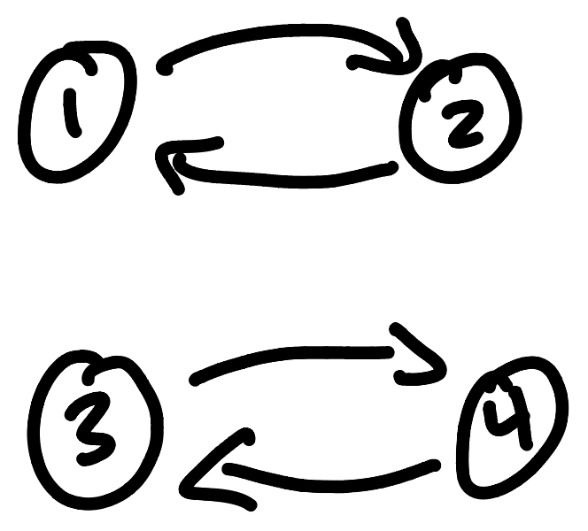
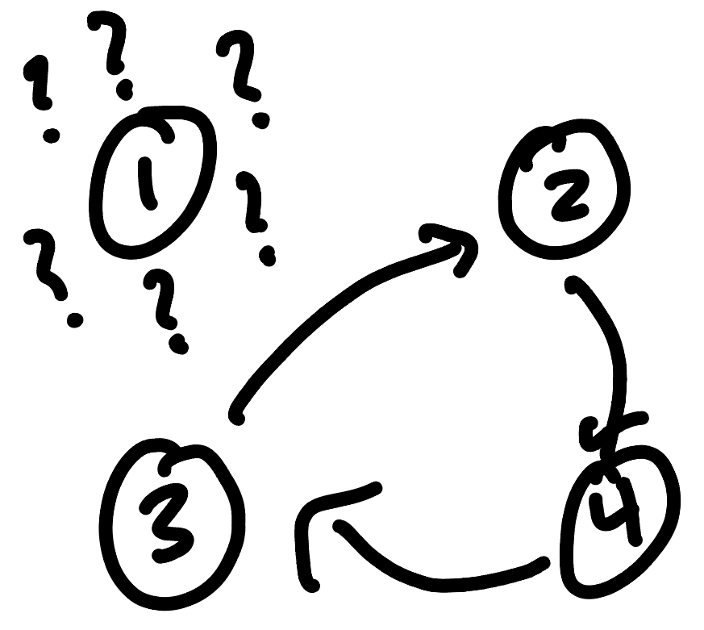
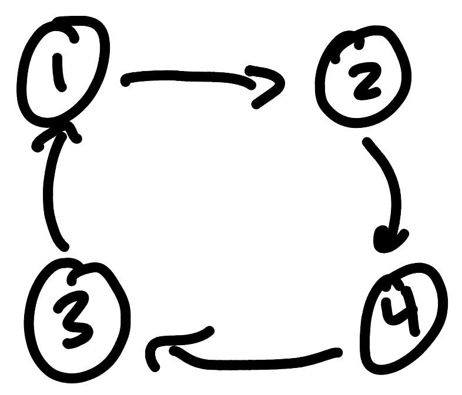

# Draw Names
Trying to create anonymous person-to-person assignments is an interesting algorithmic problem. One trusted source can create the assignments (like my fraternity roast), you can use online tools (like [DrawNames](drawnames.com) for Secret Santa), or you can use this hastily made Go script I made.

When creating a permutation of assignments, we can handle it in multiple ways. Let's say for n people we do the following:

1. Assemble a list of Person structs
2. Iterate over the list of people
3. For each person, randomly select a person from the list
4. If the person does not have an assignment, assign them
5. Otherwise find another random person

##

We could encounter the following bad formations for four people:

This is boring 

This will leave someone out 

This is exactly what we're looking for 

##

To resolve this issue we can perform the following algorithm:

1. Create a list of nodes for a linked list
2. Arbitrarily choose a head
3. Connect the head, go to its connection and find a new node
4. On the final node connect it to the head

##

This script can be used by creating a config like `example-config.yml` and pass it in as a command line argument

`go run draw-names.go ./config.yml`

Note: if you have 2FA enabled for gmail you should use this instead of your password, https://devanswers.co/create-application-specific-password-gmail/
